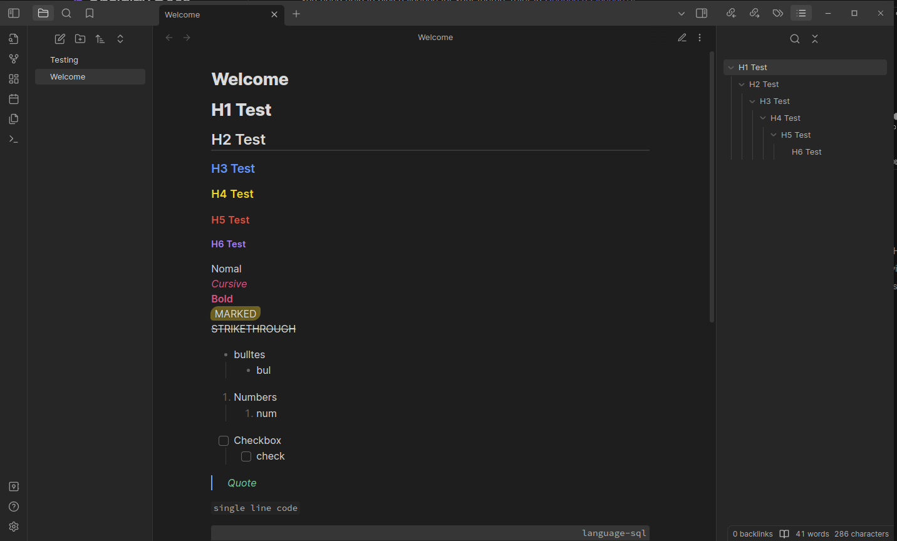

### Note

This theme for [Obsidian.md](https://obsidian.md/) was build using code from the [Things Theme](https://github.com/colineckert/obsidian-things/tree/main). 
I really like the Things theme, but i wanted to make some changes, and to be able to make changes in the future for a personal project.

Please support the original creator (**@colineckert**) of the theme, and use the original theme if you like it. Also, chances are high that the original theme is better than this one.

# Improved Potato

*Why this name?* Because I'm a potato, and I'm trying to improve myself.
Nah, just kidding. I mean, I am a potato, but that's not the reason for the name.
GitHub came up with it when creating the Repository.

## Whats the Point of this Theme?

As mentioned above, I wanted to make some changes to the original theme, while I'm also just curious about how to make a theme for Obsidian.

I have removed some functionality, that I don't use, and that I don't want to use. These were just unnecessary options and complicated configuration.

But speaking of configuration, I really like the way you can configure the theme using the **Style Settings** plugin. I have added some options to the theme, that I think are useful, and that I wanted to have.

Im also planning to add more options in the future.

This is also the main reason why I have created this theme in the first place.
I'm a huge fan of the "configure everything until its ugly" approach that the JetBrains IDEs and Obsidian itself have.

### Configuration options

- toggle fancy Code Block (copy of Things)
- toggle fancy Mermaid
- for each Header size (1-6):
  - Font Size
  - Font Color
  - Wether its underlined or not
- Divider color
- Base color (light and dark theme)
- line number color
- configurable line marker (toggle, line number color)
- Calouts
  - Custom Icons for the callouts c1 to c4

## Features

### Fancy Code blocks

Yeah i just like em

### Fancy Headers

I kinda like em and you can change them as you want.

### Custom callouts

A bunch of custom callouts.

Predefined are `info`, `text` and `mt`.

You can choose the Icon for `c1`, `c2`, `c3` and `c4`.

Every callout has to have a color attatched.

Possible colors are:
- `pink`
- `blue`
- `green`
- `yellow`
- `red`
- `purple`
- `orange`
- `light-blue`
- `cyan`
- `light-purple`
- `grey`

So this is what a valid callout would look like:

> [!info-pink] Title
> Content

# Installation

Please use the Obsidian-build-in option with the theme store.

To configure this theme, use the [Style Settings](https://github.com/mgmeyers/obsidian-style-settings) plugin.
